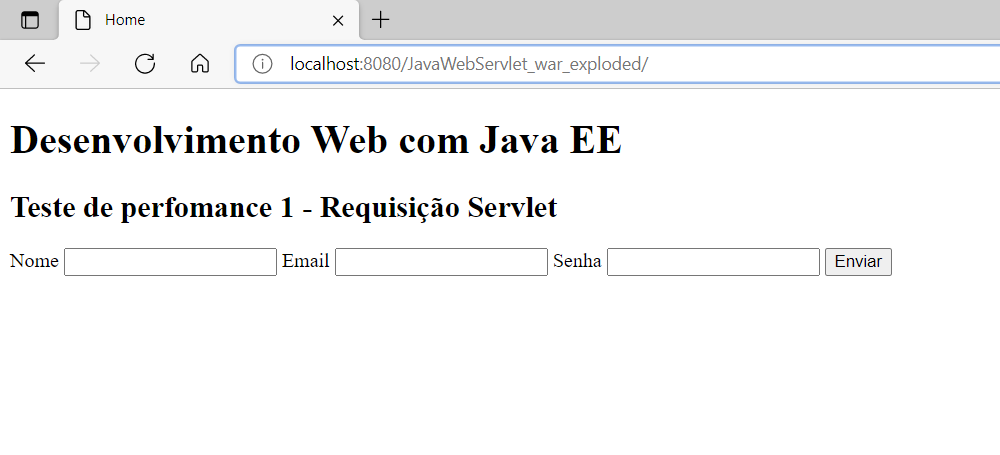
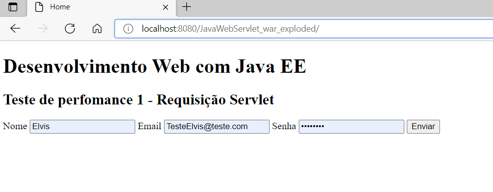
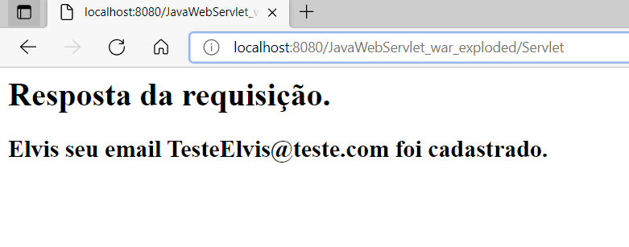

# Desenvolvimento Web com Java EE

## Teste de Performance 1

Você deve construir um servlet simples e páginas HTML para o cadastro de um usuário de um sistema web. Este usuário terá, neste momento, os seguintes campos de formulário:
1. Nome
2. E-mail
3. Senha

O formulário deve possuir um botão Salvar. Este botão deve submeter as informações utilizando o método GET ou POST. Escolha o método adequado para este contexto.
Depois que o botão Salvar for acionado, as informações de nome e e-mail do usuário cadastrado devem ser exibidas numa página de mensagem de sucesso no cadastro.

## Telas

### Index

### Eequisição

### Resposta

